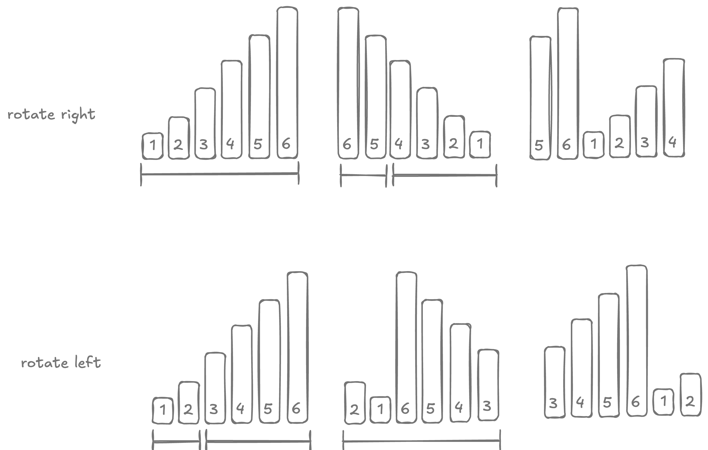

# Rotate an array

!!! info "try"
    - index: 189
    - difficulty: easy
    - [Rotate Array](https://leetcode.com/problems/rotate-array/description/)

## Description

Given an array of numbers, rotate it by `k` steps.

## Example

```
input  = [1, 2, 3, 4, 5, 6]  k = 3 
output = [4, 5, 6, 1, 2, 3]
```

## Solution

??? "Approach 1"

    Juggling Algorithm. The core idea is to divide the array into gcd(n, k) sets. Each set's elements are rotated among themselves.

    ??? "Pseudocode"

        First sanitize the input. $k$ can be greater than `nums.length` or even negative. 

        $$
        k = (n + k \ \% \ n) \ \% \ n
        $$

        Next we need divide the array in $g = gcd(n, k)$ groups:

        1. First group starts from index $0$.
        2. Second ground starts from index $1$.
        3. ...
        4. Last group starts from $g - 1$.

        For each group `i` we do the following:

        1. Backup the first element of the group `temp = a[i]`.
        2. set `curr = i` and `next = (curr + k) % n`.
        3. until we circle back to the beginning of the group (`next != start`), do:
          
            - shuffle elements forward `a[curr] = a[next]` and `curr = next`.
            - update `next = (curr + k) % n`.

        4. now that we are back to the beginning, restored the backed up element `a[curr] = temp`.

    ??? "Expand"

        $O(n)$ run time. 3ms beats 39.21%.

        ```kotlin
        fun rotateRight(nums: IntArray, k: Int): IntArray {
          val n = nums.size
          val k = (n + k % n) % n

          for (start in 0 until gcd(n, k)) {
            val backup = nums[start]
            var curr = start
            var next = (curr + k) % n

            while (next != start) {
              nums[curr] = nums[next]
              curr = next
              next = (curr + k) % n
            }

            nums[curr] = backup
          }
          return nums
        }

        fun gcd(a: Int, b: Int): Int {
          var (x, y) = a to b
          while (y != 0) {
            // swap
            x = y.also { y = x % y }
          }
          return x
        }
        ```

??? "Approach 2"
    Mirroring. 

    ??? "Pseudocode"

        

    ??? "Expand"

        $O(n)$ run time. 0ms beats 100.00%.


        ```kotlin
        fun rotateRight(nums: IntArray, k: Int): IntArray {
          val n = nums.size
          val k = (n + k % n) % n
          nums.reverse(0, n)
          nums.reverse(0, k)
          nums.reverse(k, n)
          return nums
        }

        private fun IntArray.reverse(start: Int, end: Int) {
          var l = start
          var r = end - 1
          while (l < r) {
            val t = this[l]
            this[l++] = this[r]
            this[r--] = t
          }
        }
        ```

??? "Comparison"

    By all accounts, juggling algorithm should be faster than the double reversal algorithm. After all, juggling algorithm is doing a single pass on the input whereas double reversal algorithm is doing 3x passes. However, double reversal has several points in its favour:

    1. double reversal has better cache locality since it is processing contiguous memory blocks. In juggling algorithm, we end up performing non-sequential processing by jumping by `k` positions.
    2. double reversal has simple index calculation, optimized for processors where as juggling requires complex modulo operations.

## Unit tests

```kotlin
@Test
fun right() {
  assertThat(rotate(intArrayOf(1, 2, 3, 4, 5, 6), -1))
    .isEqualTo(intArrayOf(6, 1, 2, 3, 4, 5))

  assertThat(rotate(intArrayOf(1, 2, 3, 4, 5, 6), -2))
    .isEqualTo(intArrayOf(5, 6, 1, 2, 3, 4))

  assertThat(rotate(intArrayOf(1, 2, 3, 4, 5, 6), -3))
    .isEqualTo(intArrayOf(4, 5, 6, 1, 2, 3))

  assertThat(rotate(intArrayOf(1, 2, 3, 4, 5, 6), -4))
    .isEqualTo(intArrayOf(3, 4, 5, 6, 1, 2))

  assertThat(rotate(intArrayOf(1, 2, 3, 4, 5, 6), -5))
    .isEqualTo(intArrayOf(2, 3, 4, 5, 6, 1))

  assertThat(rotate(intArrayOf(1, 2, 3, 4, 5, 6), -6))
    .isEqualTo(intArrayOf(1, 2, 3, 4, 5, 6))

  assertThat(rotate(intArrayOf(1, 2, 3, 4, 5, 6), -7))
    .isEqualTo(intArrayOf(6, 1, 2, 3, 4, 5))

  assertThat(rotate(intArrayOf(1, 2, 3, 4, 5, 6), -8))
    .isEqualTo(intArrayOf(5, 6, 1, 2, 3, 4))
}

@Test
fun left() {
  assertThat(rotate(intArrayOf(1, 2, 3, 4, 5, 6), 1))
    .isEqualTo(intArrayOf(2, 3, 4, 5, 6, 1))

  assertThat(rotate(intArrayOf(1, 2, 3, 4, 5, 6), 2))
    .isEqualTo(intArrayOf(3, 4, 5, 6, 1, 2))

  assertThat(rotate(intArrayOf(1, 2, 3, 4, 5, 6), 3))
    .isEqualTo(intArrayOf(4, 5, 6, 1, 2, 3))

  assertThat(rotate(intArrayOf(1, 2, 3, 4, 5, 6), 4))
    .isEqualTo(intArrayOf(5, 6, 1, 2, 3, 4))

  assertThat(rotate(intArrayOf(1, 2, 3, 4, 5, 6), 5))
    .isEqualTo(intArrayOf(6, 1, 2, 3, 4, 5))

  assertThat(rotate(intArrayOf(1, 2, 3, 4, 5, 6), 6))
    .isEqualTo(intArrayOf(1, 2, 3, 4, 5, 6))

  assertThat(rotate(intArrayOf(1, 2, 3, 4, 5, 6), 7))
    .isEqualTo(intArrayOf(2, 3, 4, 5, 6, 1))

  assertThat(rotate(intArrayOf(1, 2, 3, 4, 5, 6), 8))
    .isEqualTo(intArrayOf(3, 4, 5, 6, 1, 2))
}
```


