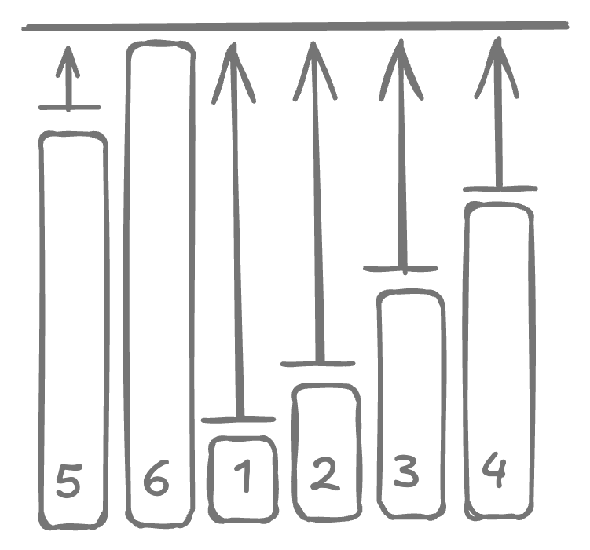

# Minimum operations to make elements equal

## Description

Given an array of integers `nums`, find the number of operations needed to make all elements equal. A single operation can increment an element by `+k`.

## Example

```
input  = [4, 7, 19, 16]  k = 3 
output = [5x +3, 4x +3, 0x +3, 1x +3] = 10 operations.
```

## Solution

??? "Approach"

    Since no number can be decreased down, the only solution is to increase all the numbers up to the same level. 
    
    {width=300px}

    Now depending on value `k`, this may or may not be possible for all values. e.g. if we have $a_i = 6$ and $k = 3$ then we can increment $a_i$ to $9$, but never to $8$. 

    ??? "Pseudocode"

        1. Find the maximum number in the array, the one which we want to turn all elements into.
        2. For all element $a_i$, find $d = \text{max} - a_i$.
        3. If $d$ is not divisible by $k$, then no solution exist and we fail-fast with $-1$ result.
        4. Otherwise, the number of operations needed to turn $a_i$ into $\text{max}$ is $\dfrac{\text{max} - a_i}{k}$. 

    ??? "Implementation"

        ```kotlin
        fun minMoves(nums: IntArray, k: Int): Int {
          val max = nums.max()

          var count = 0
          for (n in nums) {
            if ((max - n) % k != 0) return -1
            count += (max - n) / k
          }
          return count
        }
        ```

## Unit tests

```kotlin
@Test
fun first() {
  assertThat(minMoves(intArrayOf(4, 7, 19, 16), 3)).isEqualTo(10)
}

@Test
fun second() {
  assertThat(minMoves(intArrayOf(4, 4, 4, 4), 3)).isEqualTo(0)
}

@Test
fun third() {
  assertThat(minMoves(intArrayOf(4, 2, 6, 8), 3)).isEqualTo(-1)
}
```


