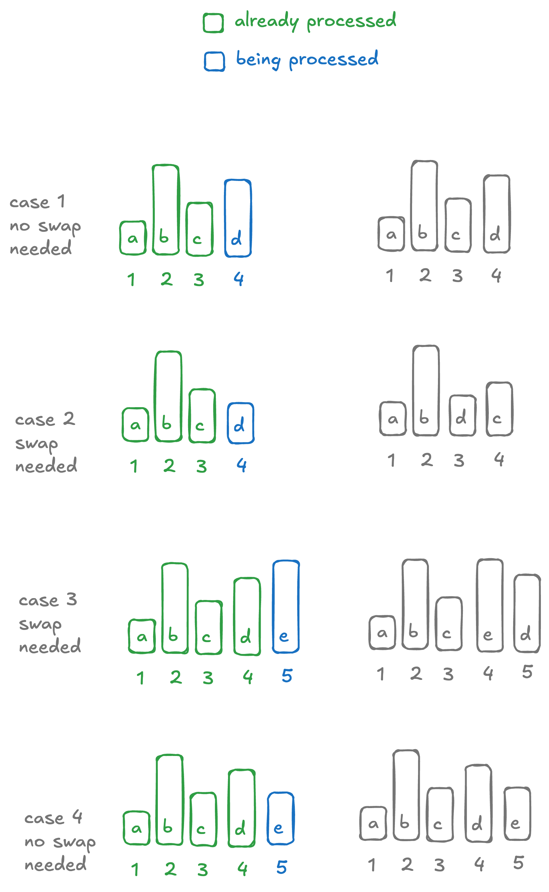

# Rearrange to make even positions greater than odds

## Description

Given an array of integers, rearrange it so that even elements at even position are greater than elements at odd position. Note that here the index $i$ starts from $1$.

## Example

```
     input  = [1, 2, 3, 4]
     output = [1, 3, 2, 4]
```

## Solution

??? "Approach"

    simple local swaps.

    ??? "Pseudocode"

        Simply iterate over the list left-to-right. At each index $i$, see if it's even or odd:

        * if it's even, then swap with $i-1$ if the condition is not met.
        * if it's even, then swap with $i-1$ if the condition is not met.

        the key insight here is that if we are processing an index $i$, having already made the array compliant until $i-1$, then: swapping $i$ with $i-1$ will not affect the previously compliant elements.

        

    ??? "Implementation"

        ```kotlin
        fun rearrangeArray(nums: IntArray): IntArray {
          for (i in 1 until nums.size) {
            // we are using 1..n for index, not 0..<n.
            val even = (i + 1) % 2 == 0 
            if (even) {
              if (nums[i-1] > nums[i]) nums.swap(i-1, i)
            } else {
              if (nums[i-1] < nums[i]) nums.swap(i-1, i)
            }
          }
          return nums
        }
        ```

## Unit tests

```kotlin
@Test
fun first() {
  assertThat(rearrangeArray(intArrayOf(1, 2, 2, 1)))
    .isEqualTo(intArrayOf(1, 2, 1, 2))
}

@Test
fun second() {
  assertThat(rearrangeArray(intArrayOf(1, 3, 1)))
    .isEqualTo(intArrayOf(1, 3, 1))
}

@Test
fun third() {
  assertThat(rearrangeArray(intArrayOf(1, 2, 3, 4)))
    .isEqualTo(intArrayOf(1, 3, 2, 4))
}

@Test
fun random() {
  val input = ThreadLocalRandom.current().ints(100, 1, 100)
    .map { i -> i }.toArray()
  val output = rearrangeArray(input.copyOf())

  for (i in 1 until output.size) {
    if ((i + 1) % 2 == 0) {
      assertThat(output[i-1] <= output[i])
    } else {
      assertThat(output[i-1] >= output[i])
    }
  }
}
```


