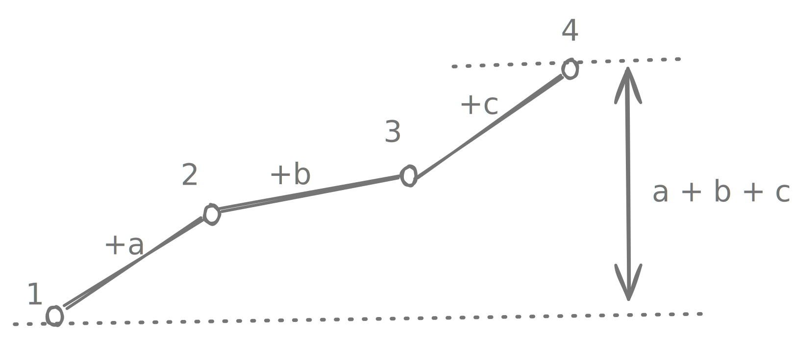
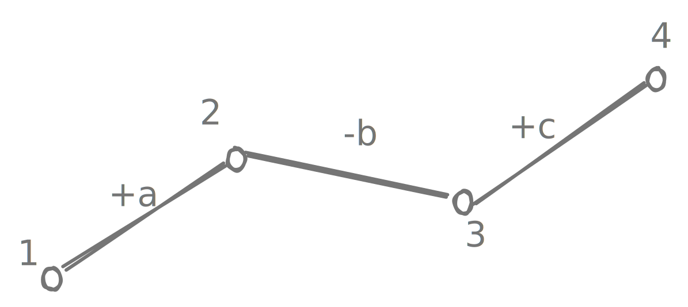

# Buy and sell stocks II

!!! info "try"
    - index: 122
    - difficulty: medium
    - [Best Time to Buy and Sell Stock II](https://leetcode.com/problems/best-time-to-buy-and-sell-stock-ii/description)

## Description

Given an array `prices` where `prices[i]` is the price of a given stock on $i^{th}$ day, maximize your profit. You can buy and sell stock multiple times.

## Example

```
input  = [7, 1, 5, 3, 6, 4]
output = 7 (buy for $1 and sell for $5, buy for $3 and sell for $6)

input  = [1, 2, 3, 4, 5]
output = 0 (buy for $1 and sell for $5)

input  = [7, 6, 4, 3, 1]
output = 0 (can never make profit)
```

## Solution

??? "Approach"

    There are two key insights here:

    1. when prices are increasing everyday, then buy-selling every day (buy on 1, sell on 2, buy on 2, sell on 3, buy on 3, sell on 4) is same as buying at the start of the interval (on 1) and selling at the end of the interval (on 4). <br> {width=300}

    2. buy low sell high. That seems obvious, but what it means for us is to buy on local minima (when price starts rising), and sell on local maxima (where price stops rising). <br> {width=300}

    ??? "Implementation"

        ```kotlin
        fun maxProfit(prices: IntArray): Int {
          // assume the first element is the first local minima
          var minima = prices[0]
          var profit = 0

          for (i in 1 until prices.size) {
            val prev = prices[i-1]
            val curr = prices[i]

            // Price droped, found a new minima.
            if (curr < prev) {
              profit += prev - minima
              minima = curr
            }
          }
          // Account for having monotonically increasing prices.
          profit += prices.last() - minima

          return profit
        }
        ```

## Unit tests

```kotlin
@Test
fun first() {
  assertThat(maxProfit(intArrayOf(7, 1, 5, 3, 6, 4)))
    .isEqualTo(7)
}

@Test
fun second() {
  assertThat(maxProfit(intArrayOf(1, 2, 3, 4, 5)))
    .isEqualTo(4)
}

@Test
fun third() {
  assertThat(maxProfit(intArrayOf(7, 6, 4, 3, 1)))
    .isEqualTo(0)
}
```


