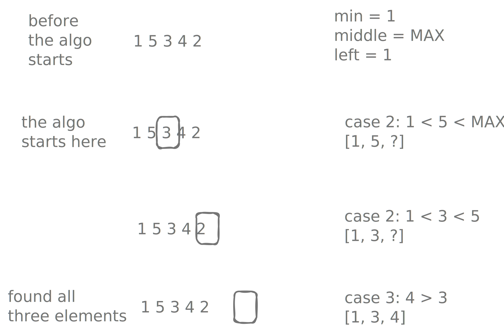

# Increasing triplets

!!! info "try"
    - index: 334
    - difficulty: medium
    - [Increasing Triplet Subsequencey](https://leetcode.com/problems/increasing-triplet-subsequence/description/)


## Description

We are given an array, find a triplet of elements such that:

- $i < j < k$
- $nums[i] < nums[j] < nums[k]$

## Example

```
input  = [1, 2, 3, 4]
output = true
explanation: (1, 2, 3) or (1, 3, 4) or (2, 3, 4) etc to name a few

input  = [5, 4, 3, 2, 1]
output = false
```

## Solution

??? "First Approach"

    Do a left-to-right pass and use auxiliary array to keep track of elements smaller than $i$ on its left. Then do another pass right-to-left, this time for elements larger than one at cursor $i$. 

    This takes $O(n)$ space and $O(n)$ time (two pass).

    ??? "Implementation"

        38ms beats 5.42%

        ```kotlin
        fun sortedSubsequence(nums: IntArray): IntArray {
          if (nums.size < 3) return intArrayOf()

          // smallest number seen in range [0, i].
          val smallest = IntArray(nums.size)
          smallest[0] = nums[0]
          for (i in 1 until nums.size) {
            smallest[i] = min(smallest[i-1], nums[i])
          }

          var largest = nums.last()
          for (i in nums.lastIndex - 1 downTo 1) {
            if (smallest[i-1] < nums[i] && nums[i] < largest) return intArrayOf(smallest[i-1], nums[i], largest)
            largest = max(largest, nums[i])
          }

          return intArrayOf()
        }
        ```

??? "Second Approach"

    This algorithm finds the triplet in a single pass, by tracking the following:

    - `min` the smallest element see so far
    - `middle` a potential middle element of our triplet
    - `left` the element that comes before `middle`, the potential first element

    The key logic is as follows:

    - if $nums[i] < min$: update `min`, we found a smaller starting point.
    - if $min < nums[i] < middle$: we found a better middle value with a smaller left element. We want it to be as small as possible, so as to cast as wide a net as possible for the last element.
    - if $min > middle$: we found the last element.

    {width=400}

    ??? "Implementation"

        4ms beats 33.13%

        ```kotlin
        fun sortedSubsequence(nums: IntArray): IntArray {
          if (nums.size < 3) return intArrayOf()

          var min = nums[0]
          var middle = Int.MAX_VALUE
          var left = nums[0]

          for (i in 1 until nums.size) {
            if (nums[i] < min) {
              min = nums[i]
            } else if (nums[i] in (min + 1)..<middle) {
              middle = nums[i]
              left = min
            } else if (nums[i] > middle) {
              return intArrayOf(left, middle, nums[i])
            }
          }

          return intArrayOf()
        }
        ```

## Unit tests

```kotlin
@Test
fun first() {
  assertThat(sortedSubsequence(intArrayOf(1, 2, 3, 4))).isEqualTo(intArrayOf(1, 2, 3))
}

@Test
fun second() {
  assertThat(sortedSubsequence(intArrayOf(4, 3, 2, 1))).isEmpty()
}

@Test
fun third() {
  assertThat(sortedSubsequence(intArrayOf(12, 11, 10, 5, 6, 2, 30))).isEqualTo(intArrayOf(5, 6, 30))
}

@Test
fun fourth() {
  assertThat(sortedSubsequence(intArrayOf(2, 1, 5, 0, 4, 6))).isEqualTo(intArrayOf(0, 4, 6))
}

@Test
fun fifth() {
  assertThat(sortedSubsequence(intArrayOf(1, 2, 2, 1))).isEmpty()
}
```


