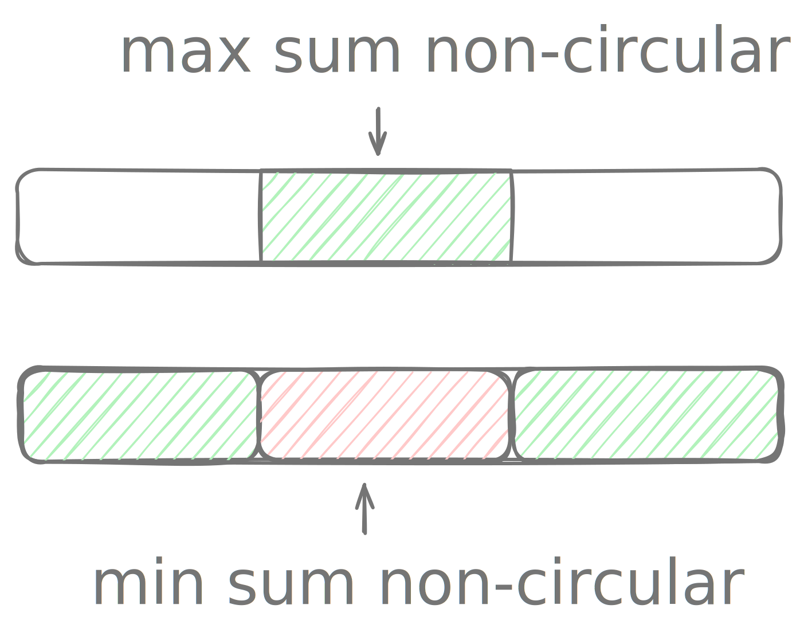

# Maximum sum circular subarray

!!! info "try"
    - index: 918
    - difficulty: medium
    - [Maximum Sum Circular Subarray](https://leetcode.com/problems/maximum-sum-circular-subarray/description/)


## Description

Given a circular array $arr$, find the maximum sum of any non-empty subarray.

## Example

```
Input:  [8, -8, 9, -9, 10, -11, 12]
Output: [12, 8, -8, 9, -9, 10]

Input:  [5, -2, 3, 4]
Output: [3, 4, 5]
```

## Solution

??? "First approach"

	Build on top of the existing [Maximum sum subarray](016-maximum-sum-subarray.md) problem. {width=300}

	- First check the default, non-circular max-sum subarray.
	- Then check the default, non-circular min-sum subarray. The complement of this is the circular max-sum subarray.
	- Pick the larger of the two.

		```kotlin 
		fun maxSubarraySumCircular(nums: IntArray): List<Int> {
			// Non-circular max-sum subarray.
			val positive = nums.sliceArray(kadane(nums))
			// Non-circular min-sum subarray's index range.
			val negative = kadane(nums.map { -it }.toIntArray())

			// Find the complement of indices in `negative`.
			val circular = mutableListOf<Int>()
			var i = (negative.last + 1) % nums.size
			while (i != negative.first) {
				circular.add(nums[i])
				i = (i + 1) % nums.size
			}
			// `circular` now contains max-sum subarray that's circular.

			return if (circular.sum() > positive.sum() && circular.isNotEmpty()) circular else positive.toList()
		}

		private fun kadane(nums: IntArray): IntRange {
			var candidate = 0..0
			var candidateSum = nums[0]

			var best = 0..0
			var bestSum = nums[0]

			for ((i, n) in nums.withIndex()) {
				if (i == 0) continue

				if (n + candidateSum > n) {
					candidate = candidate.first..i
					candidateSum += n
				} else {
					candidate = i..i
					candidateSum = n
				}

				if (candidateSum > bestSum) {
					best = candidate
					bestSum = candidateSum
				}
			}

			return best
		}
		```

## Unit tests

```kotlin
@Test
fun first() {
	assertThat(maxSubarraySumCircular(intArrayOf(8, -8, 9, -9, 10, -11, 12)))
		.containsExactly(12, 8, -8, 9, -9, 10)
}

@Test
fun second() {
	assertThat(maxSubarraySumCircular(intArrayOf(4, -1, -2, 3)))
		.containsExactly(3, 4)
}

@Test
fun third() {
	assertThat(maxSubarraySumCircular(intArrayOf(5, -2, 3, 4)))
		.containsExactly(3, 4, 5)
}

@Test
fun fourth() {
	assertThat(maxSubarraySumCircular(intArrayOf(-3, -2, -3)))
		.containsExactly(-2)
}
```


