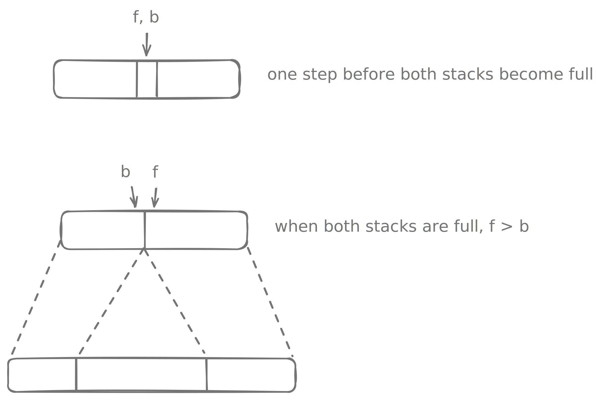
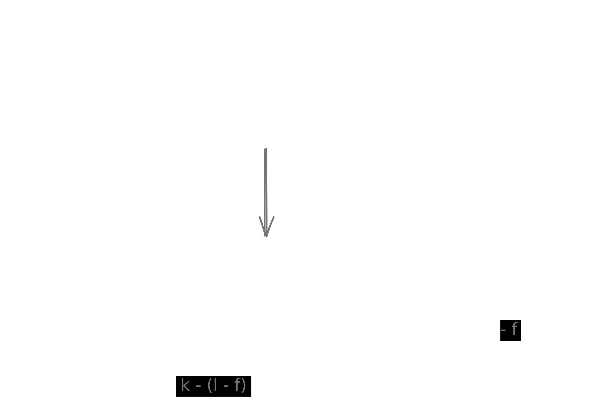

# Implement two stack in an array

Create a data structure called `TwoStacks` that represents two separate stacks, using a single underlying array. It should support the following operations:

## Placeholder

```kotlin
class TwoStack {  
  fun push1(v: Int)
  
  fun push2(v: Int)
  
  fun pop1(): Int?
  
  fun pop2(): Int?
}
```

## Solution

??? "Expand"

    We maintain two stacks on each end of the underlying array.
    

    ```kotlin
    class TwoStack {  
      
      private var items = IntArray(DEFAULT_CAPACITY)  
      private var f = 0  
      private var b = items.lastIndex  
      
      private fun maybeResize() {  
        if (f b) {  
          val l = items.size
          val k = l * 2 
      
          val newItems = IntArray(k)
          System.arraycopy(items, 0, newItems, 0, f)
          System.arraycopy(items, f, newItems, k - (l - f), l - f)
          b = k - (l - f) - 1
          items = newItems
        }  
      }  
      
      fun push1(v: Int) {  
        maybeResize()  
        items[f++] = v  
      }  
      
      fun push2(v: Int) {  
        maybeResize()  
        items[b--] = v  
      }  
      
      fun pop1(): Int? = if (f == 0) null else items[--f]  
      
      fun pop2(): Int? = if (b == items.lastIndex) null else items[++b]  
      
      override fun toString(): String {  
        return items.contentToString() + ", f=$f, b=$b"  
      }  
      
      companion object {  
        private const val DEFAULT_CAPACITY = 5  
      }  
      
    }
    ```

    The copying over of the original array to the new array requires careful managing of pointers and boundary checks. 

## Unit tests

??? "Expand"

    ```kotlin
    import org.junit.jupiter.api.Assertions.*  
    import org.junit.jupiter.api.Test  
    import org.example.org.example.TwoStack  
      
    class DynamicTwoStackTest {  
      
      @Test  
      fun `test resizing when pushing to stack 1`() {  
        val ts = TwoStack() // Tiny capacity to force resize  
        ts.push1(1)  
        ts.push1(2)  
      
        // This would have crashed before, now it should trigger resize  
        ts.push1(3)  
      
        assertEquals(3, ts.pop1())  
        assertEquals(2, ts.pop1())  
        assertEquals(1, ts.pop1())  
      }  
      
      @Test  
      fun `test resizing when pushing to stack 2`() {  
        val ts = TwoStack()  
        ts.push2(10)  
        ts.push2(20)  
      
        ts.push2(30) // Trigger resize  
      
        assertEquals(30, ts.pop2())  
        assertEquals(20, ts.pop2())  
        assertEquals(10, ts.pop2())  
      }  
      
      @Test  
      fun `test integrity of both stacks after resize`() {  
        val ts = TwoStack()  
        ts.push1(1)  
        ts.push1(2)  
        ts.push2(100)  
        ts.push2(200)  
      
        // Array is now full: [1, 2, 200, 100]  
        // Push one more to trigger resize    ts.push1(3)  
      
        // Ensure Stack 1 is intact  
        assertEquals(3, ts.pop1())  
        assertEquals(2, ts.pop1())  
        assertEquals(1, ts.pop1())  
      
        // Ensure Stack 2 survived the move to the new end of the array  
        assertEquals(200, ts.pop2())  
        assertEquals(100, ts.pop2())  
      }  
      
      @Test  
      fun `test multiple resizes`() {  
        val ts = TwoStack()  
        // Push 10 items into Stack 1  
        for (i in 1..10) {  
          ts.push1(i)  
        }  
      
        assertEquals(10, ts.pop1())  
        assertEquals(9, ts.pop1())  
      }  
      
      @Test  
      fun `test interleaved push-pop during resize`() {  
        val ts = TwoStack()  
        ts.push1(1)  
        ts.push2(2) // Array full  
      
        ts.push1(3) // Resizes  
      
        assertEquals(2, ts.pop2())  
        ts.push2(4)  
        assertEquals(4, ts.pop2())  
        assertEquals(3, ts.pop1())  
      }  
    }
    ```