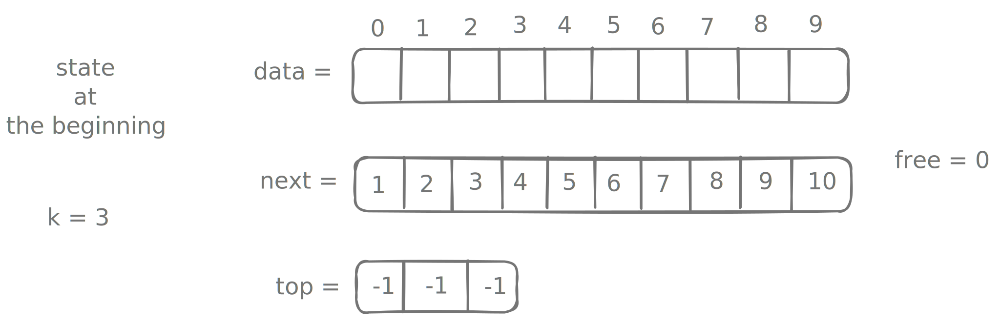

# Implement k stacks in a single array

Given two integers $n$ and $k$. Implement $k$ stacks using a single array of size $n$. Multiple stacks must share the same array space .

## Placeholder

```kotlin
class KStack(val k: Int) {

  fun push(value: Int, stack: Int) {
    // Fill here
  }

  fun pop(stack: Int): Int? {
    // Fill here
  }
}
```

## Solution

??? "First approach"

    I will not detail it here, but in simple terms, we can split an array of size $n$ into $k$ chunks of fixed size. This is going to be rather wasteful.

??? "Second approach"

    This is essentially a linked list approach, but with an array.

    

    We start with a few key data structures:

    - `data` of size $n$, the actual underlying array in which we will be saving our content.
    - `top` of size $k$, which is used to keep track of top of each stack. Initialized to $-1$ at the beginning.


        !!! tip
            Note that unlike a typical array-based stack implementation, we cannot initialize `top = 0`, for reasons that will become clear later.

    - `next` of size $n$. This is a tricky one.

          - when an index is not in use, `next[i]` points to index of next available slot.
          - when an index is already occupied, `next[i]` points to previous element in the stack. We will be using the alias `prev` when the array is used for that context.

    - `free` points to the start of free slots.

    We initialize all these in the following manner:

    ```kotlin
    class KStack(val k: Int) {

      private var data = IntArray(k * BUCKET_SIZE)
      private var next = IntArray(k * BUCKET_SIZE) // (1)
      private var prev = next                      // (2)

      private var top = IntArray(k)
      private var free = 0

      init {
        top.fill(-1)
        for (i in next.indices) {
          next[i] = i + 1
        }
      }

      // ... rest of the implementation ...

      companion object {
        private const val BUCKET_SIZE = 8
      }
    }
    ```

    1. `next` will be used when finding the next free slot.
    2. `prev` is alias to `next` and will be used duing popping of stack to update `top[stack]` to the element below the current top.

    We will be also supporting resizing of this multistack:

    ```kotlin
    private fun resize() {
      data = data.copyOf(data.size * 2)
      next = next.copyOf(next.size * 2)

      for (i in next.size / 2 until next.size) { // (1)
        next[i] = i + 1
      }
      prev = next
    }
    ```

    1. populate the second half of new `next`.

    === "Push"

        ```kotlin
        fun push(value: Int, stack: Int) {
          if (!isValidStack(stack)) // (1)
            throw IllegalArgumentException("Stack should in [0, $k)")

          if (free == data.size) { // (2)
            resize()
          }

          
          val i = free          // Pick from the "bag" of available nodes.
          free = next[free]     // Increment free to next available slot.

          prev[i] = top[stack]  // (3)
          top[stack] = i

          data[i] = value
        }
        ```

        1. checks if `stack in 0 until k`.
        2. next available pointer falls outside of current data array.
        3. The last element in the selected stack was placed at `top[stack]`. So we save this reference for future before we update `top[stack]`.

    === "Pop"

        ```kotlin linenums="1" hl_lines="17-18"
        fun pop(stack: Int): Int? {
          if (!isValidStack(stack)) 
            throw IllegalArgumentException("Stack should in [0, $k)")

          if (top[stack] == -1) return null
    
          val i = top[stack]

          // Backup the element being returned.
          // If we were handling objects in this stack, this is essential
          // for avoiding memory leaks.
          val result = data[i]
          data[i] = 0

          // Update the pointer to the element just below the top of the stack.
          top[stack] = prev[i] 
          next[i] = free
          free = i

          return result
        }
        ```

        Imagine the free list as a stack of clean trays in a cafeteria. `free` points to the tray on the very top.

        1. You just finished eating and have an empty tray (this is your popped index `i`).
        2. `next[i] = free`: You hover your tray exactly over the current top tray. Your tray is now "pointing" to the rest of the stack.
        3. `free = i`: You let go. Your tray is now officially the new top of the stack. The very next person who needs a tray (a push operation) will grab yours first.

    ### Full implementation

    ```kotlin
    package org.example

    import java.util.Stack

    class KStack(val k: Int) {

      private var data = IntArray(k * BUCKET_SIZE)
      private var next = IntArray(k * BUCKET_SIZE)
      private var prev = next

      private var top = IntArray(k)
      private var free = 0

      init {
        top.fill(-1)
        for (i in next.indices) {
          next[i] = i + 1
        }
      }

      private fun isValidStack(s: Int) = s in 0 until k

      private fun resize() {
        data = data.copyOf(data.size * 2)
        next = next.copyOf(next.size * 2)

        for (i in next.size / 2 until next.size) {
          next[i] = i + 1
        }
        prev = next
      }

      fun push(value: Int, stack: Int) {
        if (!isValidStack(stack)) 
          throw IllegalArgumentException("Stack should in [0, $k)")

        if (free == data.size) {
          resize()
        }

        // Pick from the "bag" of available nodes.
        val i = free
        free = next[free]

        prev[i] = top[stack]
        top[stack] = i
        data[i] = value
      }

      fun pop(stack: Int): Int? {
        if (!isValidStack(stack)) 
          throw IllegalArgumentException("Stack should in [0, $k)")

        if (top[stack] == -1) return null

        val i = top[stack]
        val result = data[i]
        data[i] = 0

        top[stack] = next[i]
        next[i] = free
        free = i

        return result
      }

      companion object {
        private const val BUCKET_SIZE = 8
      }
    }
    ```

## Unit tests

??? "Expand"

    ```kotlin
    package org.example

    import org.junit.jupiter.api.Test
    import org.assertj.core.api.Assertions.assertThat
    import org.assertj.core.api.Assertions.assertThatCode
    import org.assertj.core.api.Assertions.assertThatThrownBy

    class KStackTest {

      @Test
      fun `Insert in all stacks`() {
        val stack = KStack(3)
        stack.push(1, 0)
        stack.push(2, 1)
        stack.push(3, 2)

        assertThat(stack.pop(0)).isEqualTo(1)
        assertThat(stack.pop(1)).isEqualTo(2)
        assertThat(stack.pop(2)).isEqualTo(3)

        assertThat(stack.pop(0)).isNull()
        assertThat(stack.pop(1)).isNull()
        assertThat(stack.pop(2)).isNull()
      }

      @Test
      fun `Insert in just one stack`() {
        val stack = KStack(3)
        stack.push(1, 0)
        stack.push(2, 0)
        stack.push(3, 0)

        assertThat(stack.pop(0)).isEqualTo(3)
        assertThat(stack.pop(0)).isEqualTo(2)
        assertThat(stack.pop(0)).isEqualTo(1)

        assertThat(stack.pop(0)).isNull()
        assertThat(stack.pop(1)).isNull()
        assertThat(stack.pop(2)).isNull()
      }

      @Test
      fun `test pointer independence - prev and next should not share memory`() {
        val kStack = KStack(1)

        // Pushing an element should update stack history (prev)
        // without corrupting the free list (next)
        kStack.push(10, 0)

        // If the bug exists where prev == next, pushing another element
        // would fail or the free pointer would be lost (-1).
        assertThatCode {
          kStack.push(20, 0)
          kStack.push(30, 0)
        }.doesNotThrowAnyException()
      }

      @Test
      fun `test stack history integrity - pop should go down the correct stack`() {
        val kStack = KStack(2)

        // Interleave pushes to different stacks
        kStack.push(10, 0)  // Stack 0: [10]
        kStack.push(100, 1) // Stack 1: [100]
        kStack.push(20, 0)  // Stack 0: [10, 20]

        // Test Stack 0 (LIFO order)
        assertThat(kStack.pop(0)).isEqualTo(20)
        assertThat(kStack.pop(0)).isEqualTo(10)

        // Test Stack 1
        assertThat(kStack.pop(1)).isEqualTo(100)
      }

      @Test
      fun `test resize and connectivity - free list should continue after resize`() {
        // Initial capacity is k * BUCKET_SIZE (1 * 2 = 2)
        val kStack = KStack(1)

        kStack.push(1, 0)
        kStack.push(2, 0)

        // The third push MUST trigger a resize.
        // If the bug exists where free isn't updated in resize,
        // this will hang or throw an error.
        assertThatCode {
          kStack.push(3, 0)
        }.doesNotThrowAnyException()

        assertThat(kStack.pop(0)).isEqualTo(3)
        assertThat(kStack.pop(0)).isEqualTo(2)
        assertThat(kStack.pop(0)).isEqualTo(1)
      }

      @Test
      fun `test slot recycling - popped slots should be reused`() {
        val kStack = KStack(1) // Capacity 2

        kStack.push(1, 0)
        kStack.push(2, 0)

        // Pop both to make the array empty
        kStack.pop(0)
        kStack.pop(0)

        // Since we popped 2 elements, we should be able to push 2 more
        // WITHOUT triggering a resize (if recycling works correctly)
        assertThatCode {
          kStack.push(3, 0)
          kStack.push(4, 0)
        }.doesNotThrowAnyException()

        // Ensure values are correct
        assertThat(kStack.pop(0)).isEqualTo(4)
        assertThat(kStack.pop(0)).isEqualTo(3)
      }

      @Test
      fun `test boundary conditions`() {
        val kStack = KStack(3)

        // Test Underflow
        assertThat(kStack.pop(0))
          .`as`("Popping an empty stack")
          .isNull()

        // Test Invalid Stack Index
        assertThatThrownBy { kStack.push(1, 5) }
          .isInstanceOf(IllegalArgumentException::class.java)
          .hasMessageContaining("Stack should in [0, 3)")
      }
    }
    ```

