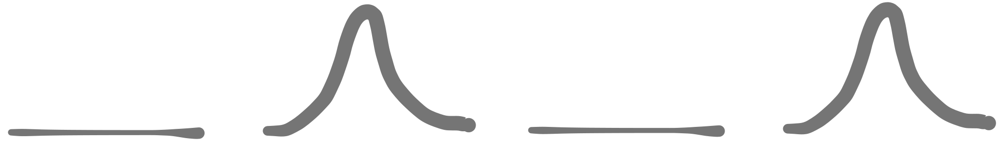

# Sliding window

Despite the name, a more apt analogy would be a piece of string.

{width=300}

The key idea is to maintain two pointers $start$ and $end$, both moving in **same direction**.

- $end$ moves continuously, and $start$ is moved when needed.
- the "length" of the metaphorical string can be
    - the actual length of the string $end - start + 1$
    - or some other invariant, e.g. numbers of elements $e$ in the string matching some arbitrary condition.

Problems involving _subarrays_ / _substrings_ with some integer constraint $k$ will usually involve this approach.